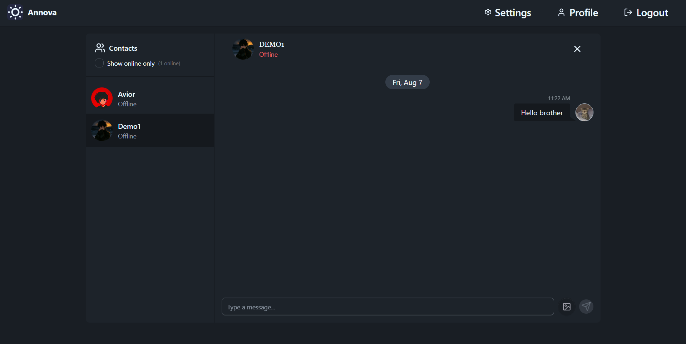
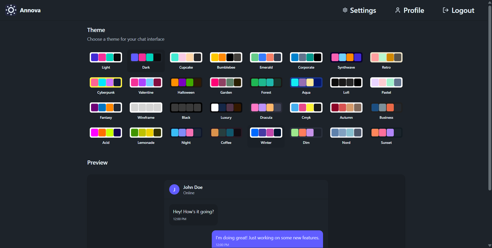

# ANNOVA - Real-Time Chat Application    [🚀 Live Preview](https://annova-chat-app.vercel.app)

**ANNOVA** is a real-time chat application that allows users to connect, chat, and share messages seamlessly. It features a modern UI, real-time messaging, and customizable themes.

---

## 📸 Screenshots

<br>

<div align="center">

| **Chat Panel** | **Settings (Themes)** |
|:---:|:---:|
| <!-- Chat screenshot placeholder - replace path below -->  | <!-- Settings/Themes screenshot placeholder - replace path below -->  |
| Real-time messaging interface. | Multiple customizable UI themes. |

</div>

---
---

## ✨ Features

- **Real-Time Messaging**: Send and receive messages instantly using WebSockets.
- **User Authentication**: Secure signup, login, and logout functionality.
- **Profile Management**: Update profile pictures and view account details.
- **Customizable Themes**: Choose from a variety of themes to personalize your chat interface.
- **Responsive Design**: Fully responsive UI for desktop and mobile devices.
- **Image Sharing**: Send and receive images in chat.
- **Online Status**: View online/offline status of users.

---

## 🗂️ Project Structure

### 📦 Backend

The backend is built with **Node.js**, **Express**, and **MongoDB**.

```
Backend/
├── .env
├── .gitignore
├── package.json
├── server.js
└── src/
    ├── app.js
    ├── config/
    │   └── config.js
    ├── controllers/
    │   ├── auth.controller.js
    │   └── messages.controller.js
    ├── db/
    │   └── db.js
    ├── lib/
    │   ├── Cloudinary.js
    │   ├── Socket.js
    │   └── utils.js
    ├── middlewares/
    │   └── Auth.middleware.js
    ├── models/
    │   ├── userModel.js
    │   └── messagesModel.js
    ├── routes/
    │   ├── auth.route.js
    │   └── messages.route.js
    └── seeds/
        └── user.seed.js
```

### 💻 Frontend

The frontend is built with **React**, **Vite**, and **TailwindCSS**.

```
Frontend/
├── .gitignore
├── eslint.config.js
├── index.html
├── package.json
├── README.md
├── vite.config.js
├── public/
│   ├── cat1.png
│   └── vite.svg
└── src/
    ├── App.jsx
    ├── index.css
    ├── main.jsx
    ├── assets/
    ├── components/
    ├── constants/
    ├── lib/
    ├── pages/
    ├── Routes/
    ├── skelaton/
    ├── store/
    └── utils/
```

---

## ⚙️ Installation

### 📌 Prerequisites

- Node.js (v16 or higher)
- MongoDB
- Cloudinary account (for image uploads)

### 🔧 Backend Setup

1. Navigate to the backend directory:

```bash
cd Backend
```

2. Install dependencies:

```bash
npm install
```

3. Create a `.env` file in the `Backend` directory and add the following:

```
MONGODB_URI=<your_mongodb_connection_string>
JWT_SECRET=<your_jwt_secret>
PORT=5000
CLOUDINARY_CLOUD_NAME=<your_cloudinary_cloud_name>
CLOUDINARY_API_KEY=<your_cloudinary_api_key>
CLOUDINARY_API_SECRET=<your_cloudinary_api_secret>
```

4. Start the backend server:

```bash
npm run dev
```

### 🎨 Frontend Setup

1. Navigate to the frontend directory:

```bash
cd Frontend
```

2. Install dependencies:

```bash
npm install
```

3. Start the development server:

```bash
npm run dev
```

---

## 📱 Usage

1. Open your browser and go to: [http://localhost:5173](http://localhost:5173)
2. Sign up or log in to your account.
3. Start chatting with other users in real-time!

---

## 🛠️ Technologies Used

### 🔙 Backend

- **Node.js** – Server-side JavaScript runtime.
- **Express** – Web framework for APIs.
- **MongoDB** – NoSQL database for user and message data.
- **Socket.IO** – Real-time bidirectional communication.
- **Cloudinary** – Image hosting and management.
- **JWT** – Secure authentication.

### 🔜 Frontend

- **React** – UI library.
- **Vite** – Fast build tool for modern web projects.
- **TailwindCSS** – Utility-first styling.
- **Zustand** – Lightweight state management.
- **React Hot Toast** – Elegant toast notifications.

---

## 📄 License

This project is licensed under the **MIT License**.

---

## 👤 Author

**Aditya Sharma**
```
